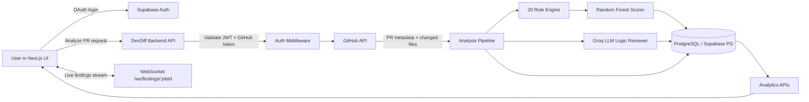

# DevDiff

## 🔍 Real-Time PR Risk Intelligence Platform

*Catch risky code earlier, with less noise.*

---

## 🎯 Features

### Security Analysis
- **20 Security Rules Engine** - Fast pattern-based detection of vulnerabilities
- **Custom ML Scorer** - Random Forest model with 15 engineered features
- **LLM Logic Review** - Groq-powered deep code analysis (optional)
- **Real-time Streaming** - WebSocket-powered live findings

### Developer Insights
- **Risk Scorecards** - Per-developer security performance metrics
- **Heatmaps** - Visualize risk patterns over time
- **Historical Analysis** - Track PR quality across projects
- **Pattern Detection** - Adaptive thresholds based on developer history

### Workflow Integration
- **GitHub OAuth** - Seamless authentication
- **Project Management** - Multi-repo support
- **False Positive Feedback** - Learn from user corrections
- **CLI Tool** - Pre-commit security scanning

---

## 🛠️ Technology Stack

### Frontend
[](https://nextjs.org/)
[](https://react.dev/)
[](https://www.typescriptlang.org/)
[](https://tailwindcss.com/)
[](https://www.framer.com/motion/)
[](https://zustand-demo.pmnd.rs/)

### Backend
[](https://nodejs.org/)
[](https://expressjs.com/)
[](https://developer.mozilla.org/en-US/docs/Web/API/WebSocket)
[](https://www.postgresql.org/)
[](https://supabase.com/)

### ML & AI
[](https://www.python.org/)
[](https://scikit-learn.org/)
[](https://en.wikipedia.org/wiki/Random_forest)
[](https://groq.com/)

### Security Analysis
[](https://tree-sitter.github.io/tree-sitter/)

---

## 📊 Architecture Overview



---

## 🚀 Quick Start

### Prerequisites
- Node.js 18+
- Python 3.12+
- PostgreSQL (or Supabase)

### Backend Setup

```bash
cd backend
npm install
cp .env.example .env

# Configure your environment variables
# SUPABASE_URL, SUPABASE_SERVICE_ROLE_KEY, DATABASE_URL

# Train ML model
py -3.12 -m pip install -r ml/requirements.txt
py -3.12 ml/train.py

# Setup database
npm run migrate
npm run seed

# Start server
npm run dev
```

### Frontend Setup

```bash
cd frontend
npm install
cp .env.local.example .env.local

# Configure:
# NEXT_PUBLIC_SUPABASE_URL
# NEXT_PUBLIC_SUPABASE_ANON_KEY
# NEXT_PUBLIC_API_URL (default: http://localhost:4000)

npm run dev
```

### Access
- Frontend: http://localhost:3000
- Backend Health: http://localhost:4000/health

---

## 📝 API Endpoints

### System
- `GET /health` - Health check

### Authentication
- `GET /api/auth/me` - Current user info
- `GET /api/auth/repos` - List GitHub repos

### Projects
- `GET /api/projects` - List projects
- `POST /api/projects` - Create project
- `GET /api/projects/:id` - Get project

### Analyze
- `POST /api/analyze` - Start PR analysis
- `GET /api/analyze/:jobId` - Check job status

### Analytics
- `GET /api/analytics/:projectId/history` - PR history
- `GET /api/analytics/:projectId/scorecard` - Scorecard
- `GET /api/analytics/:projectId/heatmap` - Risk heatmap
- `GET /api/analytics/:projectId/findings/:prId` - PR findings
- `POST /api/analytics/findings/:id/fp` - Mark false positive

### Developer
- `GET /api/developer/:projectId/:author` - Developer profile

---

## 🔐 Security Rules (20 Rules)

| # | Rule | Severity |
|---|------|----------|
| 1 | `secret-leak` | Critical |
| 2 | `sql-injection` | Critical |
| 3 | `eval-usage` | Critical |
| 4 | `xss-innerhtml` | High |
| 5 | `path-traversal` | High |
| 6 | `prototype-pollution` | High |
| 7 | `jwt-no-expiry` | High |
| 8 | `weak-hash` | Medium |
| 9 | `insecure-random` | Medium |
| 10 | `hardcoded-ip` | Medium |
| 11 | `null-deref` | Medium |
| 12 | `missing-validation` | Medium |
| 13 | `redos` | Medium |
| 14 | `memory-leak` | Medium |
| 15 | `async-await-leak` | Medium |
| 16 | `unhandled-promise` | Medium |
| 17 | `sensitive-data-log` | Medium |
| 18 | `console-log` | Low |
| 19 | `missing-rate-limit` | Low |
| 20 | `cors-wildcard` | Low |

---

## 🤖 ML Model Details

### Features (15 engineered features)
- Critical file detection
- Test file detection
- User input presence
- Template literal usage
- Null guards
- Line length buckets
- Object depth
- Async patterns
- And more...

### Model
- **Algorithm**: RandomForestClassifier
- **Estimators**: 300 trees
- **Max Depth**: 12
- **Cross-validation F1**: ~0.92

---

## 📁 Project Structure

```
devdiff/
├── backend/
│   ├── analysis/         # Pipeline + LLM reviewer
│   ├── auth/             # Supabase auth middleware
│   ├── db/               # Schema, queries, seed
│   ├── github/           # PR/repo fetchers
│   ├── intent/           # Ticket validation
│   ├── ml/               # Python ML model
│   ├── parser/           # Diff parser
│   ├── projects/         # Historical import
│   ├── routes/           # API routes
│   ├── rules/            # 20 security rules
│   └── server.js
├── frontend/
│   ├── components/       # UI components
│   ├── lib/              # Auth, websocket, store
│   ├── pages/            # Next.js pages
│   └── styles/
├── cli/
│   └── bin/devdiff.js    # Pre-commit CLI
└── tests/
```

---

## 📖 Documentation

- [API Documentation](./docs/api_documentation.md)
- [Frontend Architecture](./docs/frontend_architecture.md)
- [Backend Architecture](./docs/backend.md)
- [AI & ML Model](./docs/ai_ml_model.md)

---

## 🧪 Testing

```bash
# Backend tests
cd backend
node tests/test_diffParser.js
node tests/test_rules.js
python tests/test_ml.py

# API tests
bash tests/test_api.sh

# CLI tests
node tests/test_cli.js
```

---

## 🔧 CLI Usage

```bash
cd cli
npm install
npm link

devdiff init
devdiff check
devdiff check --json
devdiff check --json --include-tests
```

---

## 🐳 Docker

```bash
docker-compose up --build
```

---

## 📝 License

MIT

---

## 🙏 Acknowledgments

- Supabase for auth & database
- GitHub for OAuth & API access
- Groq for LLM capabilities
- scikit-learn for ML
- Tree-sitter for AST parsing